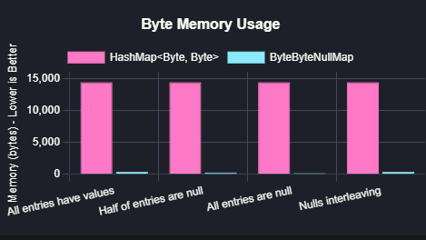
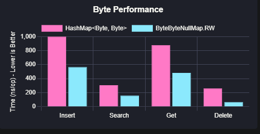

For those who care what's under the hood.

# [TL;DR](#some-performance-and-memory-benchmarks-)


## Stop Boxing, Start Performing: AdHoc Primitive Collections for Java


**Unleash the Power of Primitives in Java: High-Performance, Memory-Efficient Collections**

Java's standard generic collections are incredibly versatile, but they introduce a hidden performance bottleneck when working with primitive data types (like `int`, `long`, `float`, etc.).  This is due to **boxing**: the automatic conversion of primitives into their object wrappers (`Integer`, `Long`, `Float`).  Boxing leads to:

* **Significant Memory Overhead:** Objects consume substantially more memory than their primitive counterparts.  Imagine storing millions of integers – the `Integer` objects will take up multiple times more space than raw `int` values. This impacts memory usage, cache efficiency, and overall application footprint.
* **Performance Penalties:** Boxing and unboxing are CPU-intensive operations.  Repeatedly converting between primitives and objects adds noticeable overhead, slowing down execution, especially in tight loops and data-intensive computations.
* **Increased Garbage Collection Pressure:**  More objects mean more work for the garbage collector.  Frequent boxing creates a flood of short-lived objects, putting strain on the GC and potentially leading to pauses and reduced application responsiveness.

**AdHoc Primitive Collections** is engineered to eliminate these problems. This library provides a **comprehensive suite of collection classes specifically designed for Java primitives**. By storing primitives directly, **AdHoc Primitive Collections delivers a dramatic boost in both performance and memory efficiency** compared to standard collections when dealing with primitive data.

**Who is this library for?**

AdHoc Primitive Collections is ideal for Java developers who:

* **Demand high performance:**  Applications where speed and low latency are critical, such as financial systems, game development, high-frequency trading, scientific computing, and real-time data processing.
* **Work with large datasets of primitives:** Applications that process or store massive amounts of primitive data, where memory efficiency directly translates to cost savings and improved scalability.
* **Are sensitive to garbage collection pauses:** Applications that require consistent responsiveness and minimal interruptions from garbage collection.
* **Need fine-grained control over memory usage:** Developers who want to optimize memory footprint and improve cache locality for performance-critical sections of their code.


**Inspired by and Building Upon Proven Foundations:**

AdHoc Primitive Collections draws inspiration and lessons learned from established and respected primitive collections libraries, including:

- [Eclipse Collections](https://www.baeldung.com/java-eclipse-primitive-collections)
- [Primitive Collections for Java](https://pcj.sourceforge.net/)
- [Trove](https://bitbucket.org/trove4j/trove)
- [HPPC](https://labs.carrotsearch.com/hppc.html)
- [HPPC-RT](https://github.com/vsonnier/hppcrt)
- [fastutil](https://fastutil.di.unimi.it/)
- [Koloboke](https://github.com/leventov/Koloboke)

**Key Advantages of AdHoc Primitive Collections:**

* **Blazing Fast Performance:**  Say goodbye to boxing and unboxing overhead!  Experience significantly faster execution speeds and lower latency, especially in performance-critical loops and algorithms.
* **Extreme Memory Efficiency:** Store primitives directly in memory, drastically reducing memory footprint.  This translates to less RAM usage, improved cache utilization, and the ability to handle larger datasets.
* **Comprehensive Primitive Support, Including Advanced Types:**  Supports all standard Java primitive types (`byte`, `short`, `int`, `long`, `float`, `double`, `char`, `boolean`).  Furthermore, it provides specialized collections for **unsigned** primitives (e.g., `UByteList`, `UIntMap`) and **nullable** primitives (e.g., `IntNullList`, `LongSet`), catering to advanced use cases where these types are essential.
* **Revolutionary Garbage-Collection Friendly Iteration:**  Our innovative `token`-based iterator protocol eliminates *all* heap garbage generation during iteration.  Unlike traditional iterators that create new objects for each element, our token-based approach minimizes GC pressure, leading to smoother, more responsive applications, particularly under heavy load.
* **Flexible and Familiar Collection Types:** Provides optimized Lists, Sets, and Maps for each primitive type. The API design closely mirrors the familiar Java Collections Framework, making adoption straightforward and reducing the learning curve.
* **Read-Only (R) and Read-Write (RW) Interfaces for Enhanced Safety:** Offers a clear separation between read-only and mutable operations through `R` and `RW` interfaces.  This promotes immutability where desired, enhances code clarity, and prevents accidental modifications, leading to more robust and predictable applications.
* **Seamless Integration and Dynamic Type Safety:** Designed to integrate smoothly with existing Java code.  Collections can be used in a type-safe manner and can interoperate with generic collections when necessary, providing flexibility without sacrificing safety.
* **Ultra-Compact Storage with `BitsList`:**  For scenarios where you deal with small-range values (like enums, flags, status codes, or small integers), `BitsList` provides incredibly efficient storage by packing multiple values into individual bits.  This further optimizes memory usage, especially when storing large quantities of such data.


**Collection Interfaces: R (Read-Only) and RW (Read-Write)** 

Every collection type in AdHoc Primitive Collections is defined with two interfaces: `R` for read-only operations and `RW` for read-write operations. The `RW` interface extends `R`, ensuring that all read-only methods are available on mutable collections.

This dual-interface design provides significant advantages:

* **Enforced Immutability:**  Easily create and pass around read-only views of your primitive collections, guaranteeing data integrity and preventing unintended modifications. This is crucial for concurrent programming and defensive coding practices.
* **Clear API Intent:**  The interface type explicitly signals the intended usage of a collection.  A method accepting an `IntList.R` clearly communicates that it will only perform read operations, enhancing code readability and maintainability.
* **API Design Flexibility:**  Allows for creating methods that specifically require either read-only access (e.g., a reporting function) or read-write access (e.g., a data transformation function), leading to more precise and robust APIs.

```java
IntList.RW mutableList = new IntList.RW(); // RW - Read-Write: Create a mutable list
mutableList.add(10);
mutableList.add(20);

IntList.R readOnlyList = mutableList; // Implicitly cast to a read-only view

// readOnlyList.add(30); // Compile-time error! 'R' interface does not have 'add'

int firstElement = readOnlyList.get(0); // Read-only operations are perfectly fine
```

## Garbage-Free Token-Based Iteration -  Minimize GC Overhead

Traditional Java iterators for collections create new objects (the iterator instances themselves and often for each element accessed) during iteration. This constant object creation contributes significantly to garbage generation, especially in loops that iterate over large collections frequently.  This overhead can become a bottleneck in performance-sensitive applications.

Inspired by projects like [HPPC-RT](https://github.com/vsonnier/hppcrt) which uses recyclable iterators, `AdHoc Primitive Collections` takes garbage collection efficiency to the next level with a **groundbreaking `token`-based iteration protocol**.

**Imagine iteration without *any* new object creation during the loop.** That's the power of token-based iteration.  Instead of using iterator *objects*, you work directly with a `long` primitive `token`. This token acts like a cursor, pointing to the current element in the collection.  As you iterate, you update the token, moving it to the next element.

**This approach completely eliminates object allocation during iteration, resulting in:**

* **Zero Garbage Generation During Iteration:**  Dramatically reduces garbage collection overhead, leading to smoother application performance and reduced GC pauses, especially during long iterations over large collections.
* **Significant Performance Boost for Iteration:**  Faster iteration loops due to the complete absence of object creation and destruction.  This is particularly beneficial in performance-critical algorithms that involve frequent collection traversal.

**Understanding the Token-Based Iteration API:**

Here are the core components you'll use for token-based iteration:

1. **`token(int prevToken)` Method:** The heart of the iterator.  Call this method to advance the token. It takes the *previous* token as input (or `INIT` for the very first element) and returns the *next* valid token.  When iteration is complete, it returns `INIT` to signal the end. `INIT` is a static constant (typically `0`) defined in the `R` (read-only) interface of each collection (e.g., `IntLongMap.R.INIT`).

2. **`key(long token)` Method:**  Given a valid `token`, this method retrieves the *key* associated with that token.  For an `IntLongMap`, `key(token)` returns the `int` key.

3. **`value(long token)` Method:**  Given a valid `token`, this method retrieves the *value* associated with the token. For an `IntLongMap`, `value(token)` returns the `long` value (which might be nullable in nullable collections).

4. **Status Check Methods (`hasNull(token)`, `hasNone(token)`, `hasValue(token)`):**  These methods are crucial for working with *nullable* collections (like `IntNullList` or `IntLongMap`).  A token in a nullable collection can represent three states:
   - `NULL`: The entry exists, and its Value is explicitly set to `null`.
   - `NONE`: The entry is conceptually removed or was never set.  This state is less common in simple iteration but might be relevant in specific operations or collection types.
   - `VALUE`: The token points to a valid key-value pair with a non-null Value.

   These status methods allow you to differentiate between entries with explicit `null` values and entries that are absent or conceptually removed.

5. **`NonNullKeysIterator`, `NullKeysIterator` (Helper Classes):**  You'll often find nested static classes like `NonNullKeysIterator`, `NullKeysIterator`, etc., within collection classes (or in an `iterators` package). These are utility classes providing static helper methods to streamline token-based iteration for common scenarios, such as iterating only over non-null keys, or iterating over all keys (including null keys if the map supports them). They encapsulate the basic token manipulation logic, making your iteration code cleaner and easier to read.


**Example: Garbage-Free Iteration with `IntLongMap`**

```java
// Create a new IntLongNullMap
IntLongNullMap.RW map = new IntLongNullMap.RW();

// Add some key-value pairs
map.put( 1, 100L );
map.put( 2, 200L );
map.put( 3, 300L );
map.put( 4, null );
map.put( null, 999L ); // null key example

// Token-based iteration
// Get first token

System.out.println( "Iterating through map using tokens:" );
for( long token = map.token(); token != -1; token = map.token( token ) ) {
    if( map.hasKey( token ) ) {
        int key = map.key( token );
        System.out.print( "Key: " + key );
        
        
        if( map.hasValue( token ) ) {
            long value = map.value( token );
            System.out.println( ", Value: " + value );
        }
        else System.out.println( ", Value: null" );
    }
    else if( map.hasNullKey() && map.nullKeyHasValue() ) System.out.println( "Key: null, Value: " + map.nullKeyHasValue() );
}
		
```

While token-based iteration is a slightly different paradigm than standard Java iterators, the **zero-garbage benefit and performance gains in iteration-heavy scenarios are substantial**. Once you understand the basic token flow, you'll find it a powerful and efficient way to traverse primitive collections.


### Nullable Primitive Collections - Handling Missing or Undefined Primitive Values


#### BitList 
is presented as a memory-efficient and performant alternative for managing and querying large sequences of bits in Java. Unlike standard Java primitives, it's designed to act like a "massive Java primitive" operating on an array of bits.  It's particularly optimized for space and speed when dealing with extensive bit manipulations.

**Key Features and Design Principles:**

*   **Primitive-like on Array:**  It aims to provide functionalities similar to primitive bitwise operations but on a dynamically sized bit array.
*   **Space Efficiency:**  Employs techniques like storing *trailing ones* implicitly to reduce memory footprint, especially when dealing with bit lists that start with a sequence of '1's.
*   **Performance Optimization:** Designed for fast bit operations, likely leveraging direct array access and bitwise manipulations on `long` primitives.
*   **Trailing Ones Optimization:** A core optimization where leading '1' bits are not explicitly stored in the `values` array but tracked by `trailingOnesCount`. This is efficient if the bit list begins with many '1's.
*   **Implicit Trailing Zeros:**  Trailing '0' bits at the end of the list, beyond the last '1' bit in `values` and up to `size`, are not stored, saving space.

**Schema Depiction:**

The code comments and schema clearly define the bit order and indexing:

<pre>
                   MSB                LSB
                    |                  |
bits  in the list   [0, 0, 0, 1, 1, 1, 1]      Leading 3 zeros and trailing 4 ones
index in the list    6  5  4  3  2  1  0

                  leading            trailing
shift left                    &lt;&lt;
shift right                   &gt;&gt;&gt;

</pre>


*   **Index Direction:**  Indexes start from 0 at the LSB position and increase towards the MSB.
*   **Shift Operations:** Left shift (`<<`) moves bits towards the MSB (higher index), and right shift (`>>>`) moves bits towards the LSB (lower index).

Let's examine the key elements of the `BitList.R` (read-only base class):

*   **`size`:**  Total number of bits in the `BitList`. Includes explicit bits, trailing ones, and implicit trailing zeros.
*   **`trailingOnesCount`:** This is the cornerstone of its optimization. Instead of storing a sequence of leading '1's explicitly, it counts them. This is extremely memory-efficient if your bit list often starts with a long series of '1's.
*   **`values`:**  A `long[]` array to store the bits *after* the trailing ones interleaving bits only.
    *   The first bit in `values` (conceptually) is always '0' (the first '0' after trailing ones).
    *   The last bit in `values` (conceptually) is always '1' (the last '1' before trailing zeros).
    *   Bits are packed into `long` values, LSB-first within each `long`.


Imagine a `BitList` representing the bit sequence: `[0, 0, 0,    1, 0,    1, 1, 1]` (MSB to LSB order as per schema).

*   **Size:** 8 bits
*   **Trailing Ones (from LSB):** `[1, 1, 1]` -  There are three '1's at the LSB end. So, `trailingOnesCount = 3`.
*   **Values Array:** `values` array stores the bits *after* the `trailingOnesCount`[1, 0].  The *first* bit in `values` is always '0' and the *last* bit '1'. 
*    **Implicit Leading Zeros:**  Any bit positions *more significant* than those represented in the `values` array, up to the specified `size`, are implicitly assumed to be '0'. 


**Use Cases for Nullable Primitives:**

* **Representing Missing Data:** In many real-world datasets, primitive values might be missing or undefined. Nullable primitive collections provide a natural and efficient way to represent this missing data without resorting to sentinel values or separate boolean flags.
* **Working with Optional Values:**  When a primitive value might or might not be present, nullable collections offer a type-safe way to handle this optionality directly within the collection itself.
* **Interoperability with APIs Returning Nulls:** If you are working with external APIs or libraries that might return `null` to indicate the absence of a primitive value, nullable collections allow you to store and process these results without awkward conversions or workarounds.


#### BitsList 
Compact Storage for Small-Range Values - Maximize Memory Density

The `BitsList` is a highly specialized collection optimized for scenarios where you need to store a large number of integer values that fall within a limited range.  It's designed to pack multiple values into individual bits, achieving exceptional memory density.  Typically, `BitsList` is configured to use 1 to 7 bits per value.

**Ideal Use Cases for `BitsList`:**

* **Enums and Enum-like Structures:** When representing enumerated types or status codes where the number of possible values is small, `BitsList` provides a very memory-efficient storage solution compared to standard `EnumSet` or `ArrayList<Enum>`.
* **Flags and Boolean Attributes:** Storing boolean flags or attributes associated with a large number of entities. Instead of using a `BooleanList` (which boxes booleans), `BitsList` with 1 bit per value is vastly more memory-efficient.
* **Small Integer Ranges:**  Storing counts, categories, or other integer data where the values are guaranteed to be within a small range (e.g., 0-7, 0-15, 0-127).
* **Data Compression:**  In some cases, `BitsList` can be used as a basic form of data compression when you know the range of your integer data is limited.

```java
@interface Status { // Example "enum-like" interface (or actual enum)
    int PENDING = 0;
    int RUNNING = 1;
    int COMPLETED = 2;
}

BitsList.RW statusList = new BitsList.RW(2); // 2 bits needed to represent 3 statuses (0, 1, 2)
statusList.add(Status.PENDING);
statusList.add(Status.RUNNING);
statusList.add(Status.COMPLETED);
statusList.add(Status.PENDING);

System.out.println(statusList); // Output: [0, 1, 2, 0]
System.out.println(statusList.get(1)); // Output: 1 (Status.RUNNING)
```

`BitsList` allows you to trade off a slightly more complex API for significant memory savings when dealing with data that can be represented using a limited number of bits.  It's a powerful tool for optimizing memory footprint in specific data-intensive scenarios.

#### IntNullList

`IntNullList` is designed for storing lists of primitives that can also contain null values.  
Unlike standard Java primitive lists, `IntNullList` efficiently manages nulls without 
resorting to boxing primitives, which can be memory-inefficient and slow.
This implementation offers a flexible and performant way to handle nullable integer lists, automatically optimizing its internal 
storage strategy based on the density of null values to balance memory usage and access speed.

`IntNullList` employs a dual-strategy approach to efficiently store and access nullable integer values. 

**1. Compressed (Rank-Based) Strategy**

*   **Description**: This strategy is optimized for **space efficiency**, especially when the list contains a significant number of null values.
    *   The `values` array stores only the **non-null** integer values, stored contiguously in the order they appear logically in the list.
    *   The `nulls` `BitList` acts as an index, marking the positions of non-null values.
    *   To access a value at a given logical index:
        1.  Check the `nulls` `BitList` at the index. If it's `false`, the value is null.
        2.  If it's `true` (non-null), calculate the **rank** of the index within the `nulls` `BitList`. The rank effectively counts how many `true` bits are present *before* and *at* the given index.
        3.  Use `rank - 1` as the index into the `values` array to retrieve the corresponding non-null integer value.

*   **Advantages**:
    *   **Space Efficiency**:  Significantly reduces memory consumption when dealing with sparse lists containing many nulls, as only non-null values are stored in the `values` array.
    *   Potentially faster for iterations over non-null values, as they are stored contiguously.

*   **Disadvantages**:
    *   **Access Time**:  Accessing an element requires a rank calculation within the `BitList`, which adds a slight overhead compared to direct array access. This overhead can become more noticeable as the `BitList` grows larger.

**2. Flat (One-to-One) Strategy**

*   **Description**: This strategy prioritizes **performance** for scenarios where lists are densely populated with values (fewer nulls) and frequent element access is required.
    *   The `values` array is sized to match the logical size of the list.
    *   Each index in the `values` array corresponds directly to the same logical index in the `IntNullList`.
    *   If a logical position is null, a placeholder (likely the `default_value`, which is 0 in the provided snippet's `RW` constructor) is stored in the `values` array at that index.
    *   The `nulls` `BitList` still tracks nullity, but indexing is direct and faster.

*   **Advantages**:
    *   **Fast Access Time**: Element access is very efficient, as it's a simple direct array lookup (`values[index]`). No rank calculation is needed.
    *   Better performance for operations that access elements by index frequently.

*   **Disadvantages**:
    *   **Space Inefficiency**: Can be less memory-efficient if the list contains many null values.  Placeholder values occupy space in the `values` array even for null logical positions.

`IntNullList` automatically manages the switch between these strategies based on the `flatStrategyThreshold`.


```java
IntNullList.RW list = new IntNullList.RW(10); // Create a list with initial capacity 10
list.add1(100);
list.add1(null);
list.add1(200);

System.out.println(list.get(0)); // Output: 100
System.out.println(list.hasValue(1)); // Output: false (null value at index 1)
System.out.println(list.nextValueIndex(0)); // Output: 0
System.out.println(list.nextNullIndex(0)); // Output: 1

list.flatStrategyThreshold(1024); // Adjust the flat strategy threshold if needed
```


## Some Performance and Memory Benchmarks  

The following memory footprint report highlights the substantial memory savings of AdHoc Primitive Collections compared to the standard Java `HashMap`.  
[](https://refined-github-html-preview.kidonng.workers.dev/cheblin/PrimitiveCollections/raw/refs/heads/main/memory_report.html)
### [memory report](https://refined-github-html-preview.kidonng.workers.dev/cheblin/PrimitiveCollections/raw/refs/heads/main/memory_report.html)

**Beyond these memory benefits, performance benchmarks indicate that AdHoc Primitive Collections match or exceed the performance of standard Java 
collections for primitive data operations by eliminating boxing overhead.**  

[](https://refined-github-html-preview.kidonng.workers.dev/cheblin/PrimitiveCollections/raw/refs/heads/main/performance_report.html)
### [performance report](https://refined-github-html-preview.kidonng.workers.dev/cheblin/PrimitiveCollections/raw/refs/heads/main/performance_report.html)

This data was collected using 1,000 items; larger datasets show even greater differences. 
The code used to generate this report can be found [in the `test` folder.](https://github.com/cheblin/PrimitiveCollections/tree/main/src/test/java/org/unirail/test)

**Scala and Kotlin exhibited similar results to the standard Java HashMap**

### Androidx collections

I compared Androidx collections with AdHoc collections. In terms of functionality, 
Androidx collections are noticeably less robust than AdHoc collections, making direct comparison challenging. 

I made benchmarks, which revealed that AdHoc collections use slightly more memory but outperform Androidx collections in 
terms of speed.

### [memory report](https://refined-github-html-preview.kidonng.workers.dev/cheblin/PrimitiveCollections/raw/refs/heads/main/androidx_memory_report.html)       
### [performance report](https://refined-github-html-preview.kidonng.workers.dev/cheblin/PrimitiveCollections/raw/refs/heads/main/androidx_performance_report.html)

All tests can be found [in the `test` folder.](https://github.com/cheblin/PrimitiveCollections/tree/main/src/test/java/org/unirail/test)

----
### Report Issues

Found a bug or have a feature request? Report it [here](https://github.com/cheblin/PrimitiveCollections/issues).
